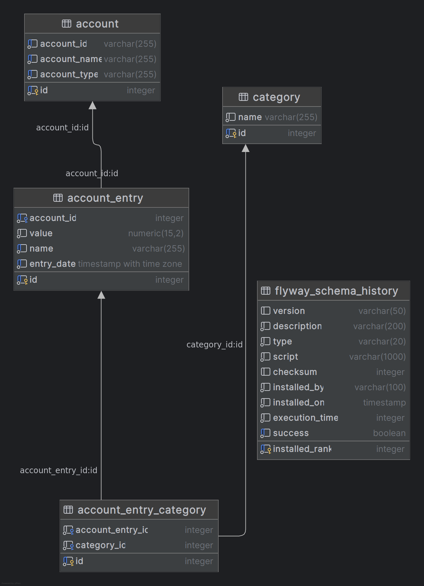

# Accounting One - Financial Accounting App

## Personas

- Customer service
- Account Managers
- AP/AR Specialist (Accounts Payable and Accounts Receivable)
- FP&A (Financial Planning and Analyst)
- CFO
- accountant

## Mission Statement

Our mission is to deliver a single-pane glass, accounting application that integrates the diverse facets of business operations enabling the business to thrive with clarity and confidence.

## Definitions

- **Account** - A financial account has a **name,** an **account ID (numerical with dashes),** and a **Type.**
    - Types include e.g. “Accounts Payable”, “Fixed Assets”, etc.
- **Account Entry -**  An entry is a transaction on an account that has a **Value,** a **name,** and a **date**
    - Values can be positive or negative **USD**

## Architecture

### Front End:
React Client Side SPA

### Back End:
Spring Boot API
- Kotlin
- Hibernate

### Storage
SQL - Postgres

### Data Diagram
> 

## How to extend, optimize, and update the solution
* API Versioning - We could version the API by adding a version number to the API path. This would allow us to make breaking changes to the API without breaking existing clients. We could also use headers to specify the version of the API instead.
* Security - We could add security to the API by adding a JWT token to the API. This would allow us to authenticate users in an identity service and authorize them to use the app. Additionally, we could add a role based system to the API to allow different users to have different permissions.
* Scalability - We could scale the API by adding more instances of the API or by adding more hardware to a single API instance (horizontal vs vertical scaling). This would allow us to handle more requests and more users. Additionally, we could add a load balancer to distribute the requests between the instances of the API and support cross region.
* Reliability - We could add reliability to the API by adding healthz endpoints that allow something like Kubernetes liveness probes to know when an API fails and spin up a new API instance. We can additionally add a retry mechanism to the client side code which would handle offline events or a store-and-forward style approach to ship change events. Lastly, we could add a circuit breaker to the API to prevent cascading failures.
* Monitoring - We could add monitoring to the API by adding an agent and shipping metrics to an APM tool like Data Dog or Elastic. This would allow us to see how the API is performing and if there are any issues. 
* Logging - We could add logging to the API by adding a logging library like Logback or Log4j. This would allow us to see what is happening in the API and debug any issues. Additionally, we could ship the logs to something like Data Dog or Elastic to see what is happening in the API.
* Other Not Mentioned - Caching, Rate Limiting, Maintainability, Performance, etc.

## Out of Scope:

- Authn/Authz
- Login and user-scoped data
- API versioning Support
- Environment considerations beyond running on a dev machine.
- General “Product grade” level deliverables.
- Scalability, most -ilities

## User Interview Highlights

- R.1 - From Bob, Customer Service: “Many of our calls with customers involve updating entry information. I need to be able to quickly view an account entry and then update its attributes. Sometimes I need to create a new account and entry if it is missing.” *A.1
- R.2 - From Lisa, Account Manager: “I manage large customer accounts and they often provide a CSV file dump of account entries. I need a way to upload the file as a bulk load instead of manually entering each line.” *A.2
- R.3 - From Sam, AP/AR specialist: “I need to be able to categorize entries to track different types of expenses. It’s important for me to see stuff like spending on software services versus construction contractors.” *A.3 *A.9
- R.4 - From Brenda, FP&A: “My job requires me to slice up the history of our overall monthly spend for the last year. This lets me forecast our future expenses per-account for things like building maintenance and wages.” *A.4 *A.8
- R.5 - From Aaron, CFO: “I give a presentation to the board every quarter where I show them how much our overall categorized spend for the last quarter compares to what we planned on spending.” *A.5 *A.8
- R.6 - From Christine, accountant: “We go through an audit every year, and auditors like to pick the most random entries out of thousands to ask for supporting documentation. They’ll usually give me an entry number, account number, and a date, but not always all three.” *A.6
- R.7 - From Tony, IT manager: “Our machines are pretty cheap. We don’t have the budget for new machines. Anyway, we get a lot of tickets that complain about slow computers, and it’s usually because they’ve burnt through most of their 4 GB of RAM. Normally, we make them open Chrome and close their tabs.”*A.7

## Assumptions

- A.1 - Need Create, Read, Update features for Accounts and Account Entries. Additionally being able to freely associate account entries to accounts and change all attributes with validation.
- A.2 - Need CSV upload for only Account Entries with validation.
- A.3 - Need to categorize Account Entries for better understand where money is going beyond Account name.
- A.4 - Brenda wants to Forecast the next year per account and per account and wants to see the spend per month for a years time. This can be provided with a graph or simply numbers. The assumption made is that she only wants it broke out by month and not by quarter. This shouldn’t be a problem because a work around is easily achieved if needed.
- A.5 - Aaron wants to know how much we spend likely per category but also possible overall per quarter. This is similar to Brenda’s needs (R.4).
- A.6 - Christine wants a robust search system searching by account entry number, account number, and a date. Account entry number could be Identifier of the account entry, the account entry name, or a new sequence number that numbers transactions sequentially. Account number could be the account identifier or the account name. and date is likely the date of the account entry. I assume the account entry number is the sequence number of the account entry. I assume the account number is the account id. If I were to play this safe, I would build searching by: account entry date between, account entry name, account entry sequence, account name, and account ID.
- A.7 - Tony has to deal with supporting lower grade hardware which has limitations especially with web browser based applications. We should ensure that most of the computational heavy tasks like sorting and searching are performed on the back end. Additionally, we should ensure that the back end properly implements pagination by only including one page at a time.
- A.8 - All planned and forecasted spending is documented outside of the accounting system.
- A.9 - An account entry can only have one category.
- A.10 - account name, account number, and account types are not nullable.
- A.11 - account entry name, account entry date are not nullable.
- A.12 - This is not right now a multitenant app.
- A.13 - Localization isn’t needed yet because the company speaks uses USD and likely all speak english.
- A.14 - We only are dealing with 2 decimal places for now. No bankers rounding needed.

## Requirements

- R.1
    - CRUD - Accounts (1 to many Account Entries)
    - CRUD - Account Entries and associate with Account.
- R.2
    - CSV upload tool for account entries
- R.3
    - CRUD - Categories and associate them to account entries.
- R.4
    - Data Report view - Visualize a year's worth of account entries
        - sum grouped by month and quarter
        - sum grouped by account and category
- R.5 - This can be implemented in R.4 as one feature.
- R.6 - Add searching to the account entries by: account entry sequence number, account id, and date.
- R.7 - We should ensure that most of the computational heavy tasks like sorting and searching are performed on the back end. Additionally, we should ensure that the back end properly implements pagination by only including one page at a time. Lastly, we could implement reduce the amount of front end component rerenders by using react memoization or a mature state management library. I recommend using Zustand for state management.

## Check list

- [x]  Does the solution compile?
- [x]  Are there at least 2 bullet point requirements from the user interviews implemented.
> 🖊 I chose the following because they form the foundational building blocks of this application.
  * R.1 - added CRUD APIS for Accounts and Account Entries and created the UIs. I also added the ability to associate account entries to accounts. I should have added account entry search but I decided against it because of time. 
  * R.3 - added database tables for Categories and associations but the front end and APIs were not created. 
  * R.7 - Reduce front end computational load by using server side pagination on the account entries.
- [x]  Does the solution demonstrate originality, expertise, and effective problem-solving?
- [x]  Is there documentation on decisions and trade offs?
> 🖊 Assumptions are documented in this file.
- [x]  Is there documentation on how to build and run the code?
> 🖊 I added a README.md file to the front end and back end that explains how to run the code.
- [x]  Is there documentation on how to setup database connection properties?
> 🖊 I added a README.md file to the back end that explains how to setup the database connection properties.
- [x]  Is there documentation on overall architecture and design choices of solution?
> 🖊 This is documented in this file.
- [x]  Is there an explanation on how the solution could be extended, optimized, or updated to account fo other non-functionals that were not required? Eg: security, API versioning, scalability, reliability, etc.
> 🖊 This is documented in this file.
- [x]  Is there consistency in the UI/UX design?
- [x]  Is the code structured and clean?
- [x]  Are there automation tests?
> 🖊 I added some controller automation tests on the back end but not on the front end. I would have added more Cypress and Vitest component and unit tests if I had more time.
